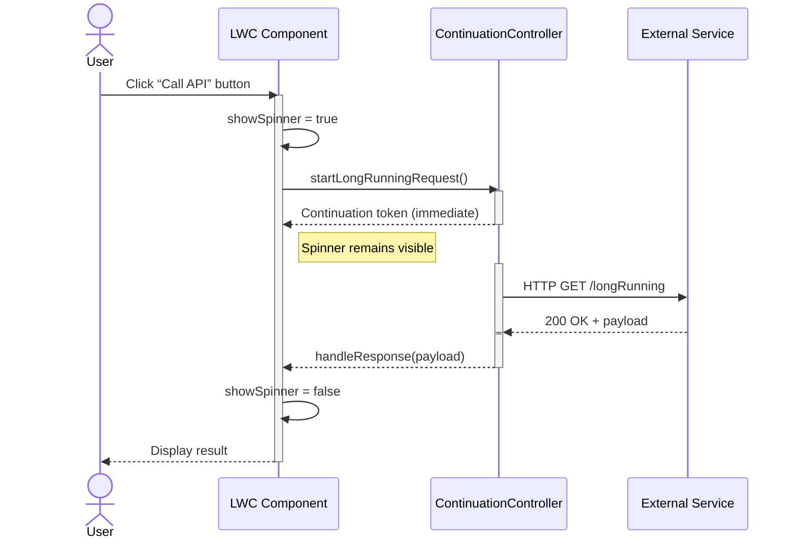

# callout with continuation




Below is a complete example showing how to invoke an Apex Continuation from a Lightning Web Component button click, display a spinner while the callout is in progress, and then handle the response once it returns.

## Apex Continuation Controller

This Apex class defines a long-running HTTP callout that returns immediately via a Continuation.

```apex
public with sharing class ContinuationCalloutController {
  // Initiates the continuation and returns control to the client
  @AuraEnabled(continuation=true)
  public static Object startLongRunningRequest() {
    // 1) Create a Continuation with a 60s timeout
    Continuation con = new Continuation(60);
    con.continuationMethod = 'handleResponse';

    // 2) Build your HTTP request
    HttpRequest req = new HttpRequest();
    req.setEndpoint('https://api.example.com/longRunning');
    req.setMethod('GET');

    // 3) Add it to the Continuation and capture the returned label
    //    You can use this label later in handleResponse to locate the exact response.
    String reqLabel = con.addHttpRequest(req);
    System.debug('Assigned Continuation request label: ' + reqLabel);

    // 4) (Optional) Store the label in state if you need it outside of labels[]
    // con.state = reqLabel;

    // 5) Return the Continuation token immediately to the client
    return con;
  }

  // Callback invoked when the HTTP response arrives
  @AuraEnabled
  public static String handleResponse(List<String> labels, Object state) {
    // 1) labels[0] is exactly the String you captured above in reqLabel
    String reqLabel = labels[0];
    System.debug('Handling response for request label: ' + reqLabel);

    // 2) Retrieve the HttpResponse using that label
    HttpResponse res = Continuation.getResponse(reqLabel);

    // 3) Process or deserialize the response body
    String body = res.getBody();
    System.debug('Response body: ' + body);

    return body;
  }
}

```

- The `@AuraEnabled(continuation=true)` annotation marks the method as returning a Continuation, which defers completion until the external service responds[^4].
- The `handleResponse` method retrieves the HTTP response and returns its body to the client[^4].


## Lightning Web Component

**JavaScript** (`continuationSpinner.js`)

```javascript
import { LightningElement, track } from 'lwc';
import startLongRunningRequest from '@salesforce/apex/ContinuationCalloutController.startLongRunningRequest';

export default class ContinuationSpinner extends LightningElement {
  @track showSpinner = false;
  @track result;
  @track error;

  async handleClick() {
    this.showSpinner = true;                        // Show spinner during callout[^1]
    this.result = undefined;
    this.error = undefined;
    try {
      const response = await startLongRunningRequest();
      this.result = response;                       // Capture response body
    } catch (err) {
      this.error = err.body ? err.body.message : err.message;
    } finally {
      this.showSpinner = false;                     // Hide spinner once done[^5]
    }
  }
}
```

- The `showSpinner` flag controls whether the `<lightning-spinner>` is rendered[^1].
- An imperative call to `startLongRunningRequest()` returns a promise that resolves when the continuation callback completes[^4].

**HTML** (`continuationSpinner.html`)

```html
<template>
  <lightning-button
    label="Start Long-Running Request"
    onclick={handleClick}
    class="slds-m-bottom_small">
  </lightning-button>

  <template if:true={showSpinner}>
    <lightning-spinner
      alternative-text="Processing..."
      size="medium">
    </lightning-spinner>
  </template>

  <template if:true={result}>
    <div class="slds-m-top_small">
      <strong>Response:</strong> {result}
    </div>
  </template>

  <template if:true={error}>
    <div class="slds-text-color_error slds-m-top_small">
      <strong>Error:</strong> {error}
    </div>
  </template>
</template>
```

- The spinner component displays whenever `showSpinner` is true[^1].
- Conditional templates render the response or error once the callout completes[^5].

This pattern cleanly separates UI concerns (button and spinner) from the asynchronous callout logic using Apex Continuations. The spinner provides immediate feedback, and the client-side code stays concise by leveraging `async/await` with a `finally` block to always hide the spinner once the operation finishes.

<div style="text-align: center">⁂</div>

[^1]: https://help.salesforce.com/s/articleView?id=sf.os_spinner_lightning_web_component_readme.htm\&language=en_US\&type=5

[^2]: https://developer.salesforce.com/blogs/2020/05/apex-continuations-implementation-and-testing-in-aura-lwc

[^3]: https://trailhead.salesforce.com/trailblazer-community/feed/0D54V00007T4RdoSAF

[^4]: https://developer.salesforce.com/docs/platform/lwc/guide/apex-continuations-component-example.html

[^5]: https://www.sfdcpoint.com/salesforce/lightning-spinner-in-lwc-lightning-web-component/

[^6]: https://salesforce.stackexchange.com/questions/425821/in-lwc-how-to-put-up-spinner-while-long-running-apex-method-runs

[^7]: https://developer.salesforce.com/docs/atlas.en-us.apexcode.meta/apexcode/apex_continuation_overview.htm

[^8]: https://www.lightningdesignsystem.com/2e1ef8501/p/7733f8-buttons

[^9]: https://developer.salesforce.com/docs/atlas.en-us.lightning.meta/lightning/apex_continuations.htm

[^10]: https://www.salesforcechacha.com/p/patience-is-a-virtue

[^11]: https://help.salesforce.com/s/articleView?id=sf.os_make_a_long_running_remote_call_using_vlocitycontinuationintegration.htm\&language=fr\&type=5

[^12]: https://stackoverflow.com/questions/61332655/showing-a-loading-indicator-while-calling-apex-in-salesforce-lwc

[^13]: https://salesforce.stackexchange.com/questions/220084/apex-continuation-response-method

[^14]: https://www.jitendrazaa.com/blog/salesforce/limitless-chaining-of-continuation-object-in-salesforce/

[^15]: https://www.jitendrazaa.com/blog/salesforce/design-continuation-server-in-salesforce/

[^16]: https://developer.salesforce.com/docs/platform/lwc/guide/apex-continuations.html

[^17]: https://developer.salesforce.com/docs/atlas.en-us.object_reference.meta/object_reference/sforce_api_objects_eventlogfile_continuationcalloutsummary.htm


# Error handling and retry logic in the callback

Passing custom state through the Continuation’s state property

Support for multiple concurrent callouts in one Continuation

Unit‐test stubs using ContinuationMockropositions :

Below are four enhancements to the Continuation pattern:

- Error handling and retry logic in the callback
- Passing custom state through the Continuation’s `state` property
- Support for multiple concurrent callouts in one Continuation
- Unit-test stubs using `ContinuationMock`


## Error Handling and Retry Logic in the Callback

Implement retry by tracking attempts in the Continuation’s state and, if a callout fails, issuing a new Continuation from within the callback until a maximum retry count is reached[^1].

```apex
public with sharing class ContinuationRetryController {
  private static final Integer MAX_RETRIES = 3;
  private class StateInfo {
    public Integer attempts;
    public StateInfo(Integer attempts) { this.attempts = attempts; }
  }

  @AuraEnabled(continuation=true)
  public static Object startRequest() {
    Continuation con = new Continuation(60);
    con.continuationMethod = 'handleResponse';
    // initialize retry count
    con.state = new StateInfo(0);
    HttpRequest req = new HttpRequest();
    req.setEndpoint('https://api.example.com/unstable');
    req.setMethod('GET');
    con.addHttpRequest(req);
    return con;
  }

  @AuraEnabled
  public static String handleResponse(List<String> labels, Object state) {
    StateInfo info = (StateInfo) state;
    HttpResponse res = Continuation.getResponse(labels[0]);

    // success path
    if (res.getStatusCode() >= 200 && res.getStatusCode() < 300) {
      return res.getBody();
    }

    // retry path
    if (info.attempts < MAX_RETRIES) {
      info.attempts++;
      // start a fresh continuation for retry
      Continuation con = new Continuation(60);
      con.continuationMethod = 'handleResponse';
      con.state = info;
      con.addHttpRequest(new HttpRequest()
        .setEndpoint('https://api.example.com/unstable')
        .setMethod('GET'));
      return con;
    }

    // all retries exhausted
    throw new AuraHandledException(
      'External service failed after ' + info.attempts + ' attempts: ' + res.getStatus());
  }
}
```

In this pattern, the callback returns either a String (final result) or a new Continuation object (to retry) until `MAX_RETRIES` is exceeded[^1].

## Passing Custom State Through Continuation

Use the `state` property to pass any Apex object or primitive into the callback[^2].

```apex
public with sharing class ContinuationStateController {
  // simple state holder
  public class StateInfo { public String message; public Integer count; 
    public StateInfo(String msg, Integer cnt) { message=msg; count=cnt; }
  }

  @AuraEnabled(continuation=true)
  public static Object startWithState() {
    Continuation con = new Continuation(60);
    con.continuationMethod = 'processResponse';
    con.state = new StateInfo('initial', 42);
    HttpRequest req = new HttpRequest();
    req.setEndpoint('https://api.example.com/echo');
    req.setMethod('POST');
    con.addHttpRequest(req);
    return con;
  }

  @AuraEnabled
  public static Map<String, Object> processResponse(List<String> labels, Object state) {
    StateInfo info = (StateInfo) state;
    HttpResponse res = Continuation.getResponse(labels[^0]);

    // return both the response body and original state
    return new Map<String, Object>{
      'body' => res.getBody(),
      'originalMessage' => info.message,
      'originalCount' => info.count
    };
  }
}
```

The `processResponse` method can access both the HTTP response and whatever data you stashed in `con.state`[^4].

## Multiple Concurrent Callouts in One Continuation

Add up to three independent `HttpRequest` objects to a single Continuation and process them together in the callback[^5].

```apex
public with sharing class ContinuationMultiController {
  public String label1, label2;

  @AuraEnabled(continuation=true)
  public static Object startParallelRequests() {
    Continuation con = new Continuation(60);
    con.continuationMethod = 'processAllResponses';

    HttpRequest req1 = new HttpRequest();
    req1.setEndpoint('https://api.example.com/serviceA');
    req1.setMethod('GET');
    String l1 = con.addHttpRequest(req1);

    HttpRequest req2 = new HttpRequest();
    req2.setEndpoint('https://api.example.com/serviceB');
    req2.setMethod('GET');
    String l2 = con.addHttpRequest(req2);

    return con;
  }

  @AuraEnabled
  public static Map<String, String> processAllResponses(List<String> labels, Object state) {
    HttpResponse res1 = Continuation.getResponse(labels[^0]);
    HttpResponse res2 = Continuation.getResponse(labels[^1]);
    return new Map<String, String>{
      'serviceA' => res1.getBody(),
      'serviceB' => res2.getBody()
    };
  }
}
```

The callback receives all labels in the same order you added the requests and can handle them in bulk[^5].

## Unit-Test Stubs Using ContinuationMock

Simulate Continuation callouts in tests with `Test.setContinuationResponse` and `Test.invokeContinuationMethod`[^7].

```apex
@IsTest
public class ContinuationControllerTest {
  @IsTest static void testSuccessPath() {
    ContinuationRetryController ctrl = new ContinuationRetryController();
    // Kick off continuation
    Continuation cont = (Continuation) ctrl.startRequest();
    // Create mock response
    HttpResponse mockRes = new HttpResponse();
    mockRes.setStatusCode(200);
    mockRes.setBody('OK');
    // Stub the continuation response
    Test.setContinuationResponse('0', mockRes); // first label is "0"
    // Invoke the callback
    Object result = Test.invokeContinuationMethod(ctrl, cont);
    // Verify final result
    System.assertEquals('OK', result);
  }
}
```

This pattern lets you cover both `startRequest` and `handleResponse` paths without real HTTP calls[^7].

---

These examples extend the basic Continuation pattern to handle retries, carry custom context, run parallel callouts, and test asynchronously with mocks.

<div style="text-align: center">⁂</div>

[^1]: https://blog.salesforcecasts.com/retrying-failed-callouts-in-salesforce-apex-best-practices-with-code-snippet/

[^2]: https://developer.salesforce.com/docs/platform/lwc/guide/apex-continuations-apex.html

[^3]: https://sfdcian.com/retrying-unsuccessful-callouts-in-salesforce-apex-recommended-approaches-with-code-examples/

[^4]: https://suhasrathod.wordpress.com/2022/03/09/continuation-apex-class/

[^5]: https://developer.salesforce.com/docs/atlas.en-us.apexcode.meta/apexcode/apex_continuation_multiple_callouts.htm

[^6]: https://trailhead.salesforce.com/content/learn/modules/apex-testing-write-unit-tests/use-mock-and-stub-objects

[^7]: http://sfdcintegration.blogspot.com/2016/07/test-class-for-asynchronous-callouts.html

[^8]: https://www.sfdcblogs.com/post/make-long-running-callouts-using-continuations

[^9]: https://sfdctechie.wordpress.com/2020/11/18/how-to-use-continuation-method-in-lightning-web-components-lwc/

[^10]: https://salesforce.stackexchange.com/questions/339539/issue-with-testing-callback-of-continuation-no-method-on-provided-controller-t

[^11]: https://www.slideshare.net/slideshow/continuationalan20220503pdf-251737588/251737588

[^12]: https://developer.salesforce.com/docs/platform/lwc/guide/apex-continuations.html

[^13]: https://www.merkle.com/en/merkle-now/articles-blogs/2023/apex-continuation.html

[^14]: https://salesforce.stackexchange.com/questions/78329/what-should-be-a-good-aproach-to-retry-a-web-service-callout

[^15]: https://salesforcegeek.in/error-handling-in-salesforce-apex/

[^16]: https://developer.salesforce.com/docs/atlas.en-us.apexref.meta/apexref/apex_class_System_Continuation.htm

[^17]: https://developer.salesforce.com/docs/atlas.en-us.lightning.meta/lightning/apex_continuations.htm

[^18]: https://www.linkedin.com/posts/deedev_salesforce-apex-lwc-activity-7250890471634284546-fn_R

[^19]: https://jzonebyte-dev-ed.develop.my.site.com/s/blogs/salesforce/apex-continuation

[^20]: https://salesforcebitsandbytes.com/how-to-retry-the-callout-3-times-on-http-requests-based-on-the-response-in-apex/

[^21]: https://developer.salesforce.com/docs/platform/lwc/guide/apex-continuations-limits.html

[^22]: https://www.linkedin.com/posts/kkteja_apex-continuation-design-pattern-in-simple-activity-7093417968767807489-F3St

[^23]: https://www.sfdcblogs.com/post/make-long-running-callouts-using-continuations

[^24]: https://stackoverflow.com/questions/15754576/how-can-i-pass-variables-state-from-one-page-to-another-if-both-pages-use-the-s

[^25]: https://developer.salesforce.com/docs/atlas.en-us.lightning.meta/lightning/apex_continuations_apex.htm

[^26]: https://salesforce.stackexchange.com/questions/220084/apex-continuation-response-method

[^27]: https://help.mypurecloud.com/articles/use-the-extension-points-to-customize-saving-interaction-logs/

[^28]: https://stackoverflow.com/questions/24183566/call-with-current-continuation-state-saving-concept

[^29]: https://www.learnexperiencecloud.com/article/Guest-User-Record-Access-Development-Best-Practices

[^30]: https://salesforce.stackexchange.com/questions/121224/how-to-get-the-info-on-asyncallouts-made-with-continuation-frameworkor-class

[^31]: https://www.skbsfdc.com/2021/11/long-running-callouts-with-multiple.html

[^32]: https://www.oracle.com/a/otn/docs/apex_ebs_extension_technical_paper.pdf

[^33]: https://www.linkedin.com/pulse/making-callouts-from-batch-apex-salesforce-jeet-singh-e6m5f

[^34]: https://www.linkedin.com/posts/sudeerkamat_salesforce-apex-lwc-activity-7086192785652936704-G3NT

[^35]: https://salesforcegeek.in/how-to-make-callouts-in-apex-with-example/

[^36]: https://www.jitendrazaa.com/blog/salesforce/continuation-object-in-apex-asynchronous-callouts-for-long-running-request-live-demo/

[^37]: https://developer.salesforce.com/docs/atlas.en-us.apexcode.meta/apexcode/apex_continuation_limits.htm

[^38]: https://developer.salesforce.com/docs/atlas.en-us.apexcode.meta/apexcode/apex_continuation_testing.htm

[^39]: https://learn.microsoft.com/en-us/archive/msdn-magazine/2007/september/unit-testing-exploring-the-continuum-of-test-doubles

[^40]: https://developer.salesforce.com/blogs/2020/05/apex-continuations-implementation-and-testing-in-aura-lwc

[^41]: https://developer.salesforce.com/docs/atlas.en-us.apexcode.meta/apexcode/apex_classes_restful_http_testing_httpcalloutmock.htm

[^42]: https://www.mstsolutions.com/technical/long-running-callouts-in-salesforce/

[^43]: https://bluewavecx.com/blog/writing-unit-tests-for-restful-apex-methods/

[^44]: https://www.jitendrazaa.com/blog/salesforce/limitless-chaining-of-continuation-object-in-salesforce/

[^45]: https://developer.salesforce.com/docs/atlas.en-us.apexcode.meta/apexcode/apex_continuation_overview.htm

[^46]: https://github.com/trailheadapps/lwc-recipes/issues/117

[^47]: https://help.salesforce.com/s/articleView?id=release-notes.rn_forcecom_ext_services_apex_unit_testing.htm\&release=232\&type=5\&language=en_US

[^48]: https://salesforce.stackexchange.com/questions/15148/best-practices-callout-retry

[^49]: https://devopslaunchpad.com/blog/advanced-apex-error-handling/

[^50]: https://fastercapital.com/content/Error-Handling--Error-Handling-Made-Easier-with-Continuation-Patterns.html

[^51]: https://salesforce.stackexchange.com/questions/139459/continuation-error-while-declaring-the-state-variable

[^52]: https://salesforce.stackexchange.com/questions/207162/parallel-callouts-in-apex

[^53]: https://github.com/willianmatheus98/continuation-apex

[^54]: https://www.reddit.com/r/salesforce/comments/etbbah/joys_of_apex_future_methods_callouts_and_callbacks/

[^55]: https://www.youtube.com/watch?v=-Vgx14cLm5Y

[^56]: https://developer.salesforce.com/docs/atlas.en-us.apexcode.meta/apexcode/apex_testing_stub_api.htm

[^57]: https://salesforce.stackexchange.com/questions/410517/how-to-use-stub-api-in-order-to-create-authsession-records-in-test-class

[^58]: https://salesforce.stackexchange.com/questions/262211/continuation-apex-unit-testing-lightning

[^59]: https://spring.io/blog/2007/01/15/unit-testing-with-stubs-and-mocks


[^18]: https://salesforce.stackexchange.com/questions/365456/spinner-when-apex-is-loading-lwc

[^19]: https://developer.salesforce.com/docs/atlas.en-us.apexcode.meta/apexcode/apex_continuation_process.htm

[^20]: https://www.salesforceben.com/create-lightning-web-components-lwc-using-quick-actions/

