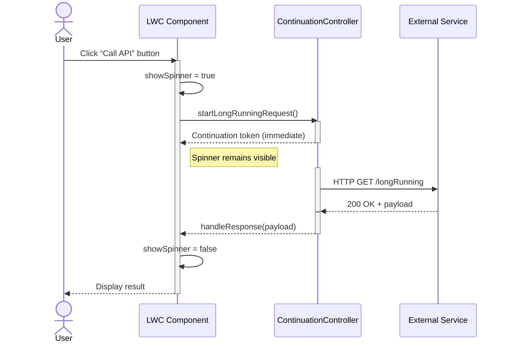

# callout




Below is a complete example showing how to invoke an Apex Continuation from a Lightning Web Component button click, display a spinner while the callout is in progress, and then handle the response once it returns.

## Apex Continuation Controller

This Apex class defines a long-running HTTP callout that returns immediately via a Continuation.

```apex
public with sharing class ContinuationCalloutController {
  // Initiates the continuation and returns control to the client
  @AuraEnabled(continuation=true)
  public static Object startLongRunningRequest() {
    // 1) Create a Continuation with a 60s timeout
    Continuation con = new Continuation(60);
    con.continuationMethod = 'handleResponse';

    // 2) Build your HTTP request
    HttpRequest req = new HttpRequest();
    req.setEndpoint('https://api.example.com/longRunning');
    req.setMethod('GET');

    // 3) Add it to the Continuation and capture the returned label
    //    You can use this label later in handleResponse to locate the exact response.
    String reqLabel = con.addHttpRequest(req);
    System.debug('Assigned Continuation request label: ' + reqLabel);

    // 4) (Optional) Store the label in state if you need it outside of labels[]
    // con.state = reqLabel;

    // 5) Return the Continuation token immediately to the client
    return con;
  }

  // Callback invoked when the HTTP response arrives
  @AuraEnabled
  public static String handleResponse(List<String> labels, Object state) {
    // 1) labels[0] is exactly the String you captured above in reqLabel
    String reqLabel = labels[0];
    System.debug('Handling response for request label: ' + reqLabel);

    // 2) Retrieve the HttpResponse using that label
    HttpResponse res = Continuation.getResponse(reqLabel);

    // 3) Process or deserialize the response body
    String body = res.getBody();
    System.debug('Response body: ' + body);

    return body;
  }
}

```

- The `@AuraEnabled(continuation=true)` annotation marks the method as returning a Continuation, which defers completion until the external service responds[^4].
- The `handleResponse` method retrieves the HTTP response and returns its body to the client[^4].


## Lightning Web Component

**JavaScript** (`continuationSpinner.js`)

```javascript
import { LightningElement, track } from 'lwc';
import startLongRunningRequest from '@salesforce/apex/ContinuationCalloutController.startLongRunningRequest';

export default class ContinuationSpinner extends LightningElement {
  @track showSpinner = false;
  @track result;
  @track error;

  async handleClick() {
    this.showSpinner = true;                        // Show spinner during callout[^1]
    this.result = undefined;
    this.error = undefined;
    try {
      const response = await startLongRunningRequest();
      this.result = response;                       // Capture response body
    } catch (err) {
      this.error = err.body ? err.body.message : err.message;
    } finally {
      this.showSpinner = false;                     // Hide spinner once done[^5]
    }
  }
}
```

- The `showSpinner` flag controls whether the `<lightning-spinner>` is rendered[^1].
- An imperative call to `startLongRunningRequest()` returns a promise that resolves when the continuation callback completes[^4].

**HTML** (`continuationSpinner.html`)

```html
<template>
  <lightning-button
    label="Start Long-Running Request"
    onclick={handleClick}
    class="slds-m-bottom_small">
  </lightning-button>

  <template if:true={showSpinner}>
    <lightning-spinner
      alternative-text="Processing..."
      size="medium">
    </lightning-spinner>
  </template>

  <template if:true={result}>
    <div class="slds-m-top_small">
      <strong>Response:</strong> {result}
    </div>
  </template>

  <template if:true={error}>
    <div class="slds-text-color_error slds-m-top_small">
      <strong>Error:</strong> {error}
    </div>
  </template>
</template>
```

- The spinner component displays whenever `showSpinner` is true[^1].
- Conditional templates render the response or error once the callout completes[^5].

This pattern cleanly separates UI concerns (button and spinner) from the asynchronous callout logic using Apex Continuations. The spinner provides immediate feedback, and the client-side code stays concise by leveraging `async/await` with a `finally` block to always hide the spinner once the operation finishes.

<div style="text-align: center">⁂</div>

[^1]: https://help.salesforce.com/s/articleView?id=sf.os_spinner_lightning_web_component_readme.htm\&language=en_US\&type=5

[^2]: https://developer.salesforce.com/blogs/2020/05/apex-continuations-implementation-and-testing-in-aura-lwc

[^3]: https://trailhead.salesforce.com/trailblazer-community/feed/0D54V00007T4RdoSAF

[^4]: https://developer.salesforce.com/docs/platform/lwc/guide/apex-continuations-component-example.html

[^5]: https://www.sfdcpoint.com/salesforce/lightning-spinner-in-lwc-lightning-web-component/

[^6]: https://salesforce.stackexchange.com/questions/425821/in-lwc-how-to-put-up-spinner-while-long-running-apex-method-runs

[^7]: https://developer.salesforce.com/docs/atlas.en-us.apexcode.meta/apexcode/apex_continuation_overview.htm

[^8]: https://www.lightningdesignsystem.com/2e1ef8501/p/7733f8-buttons

[^9]: https://developer.salesforce.com/docs/atlas.en-us.lightning.meta/lightning/apex_continuations.htm

[^10]: https://www.salesforcechacha.com/p/patience-is-a-virtue

[^11]: https://help.salesforce.com/s/articleView?id=sf.os_make_a_long_running_remote_call_using_vlocitycontinuationintegration.htm\&language=fr\&type=5

[^12]: https://stackoverflow.com/questions/61332655/showing-a-loading-indicator-while-calling-apex-in-salesforce-lwc

[^13]: https://salesforce.stackexchange.com/questions/220084/apex-continuation-response-method

[^14]: https://www.jitendrazaa.com/blog/salesforce/limitless-chaining-of-continuation-object-in-salesforce/

[^15]: https://www.jitendrazaa.com/blog/salesforce/design-continuation-server-in-salesforce/

[^16]: https://developer.salesforce.com/docs/platform/lwc/guide/apex-continuations.html

[^17]: https://developer.salesforce.com/docs/atlas.en-us.object_reference.meta/object_reference/sforce_api_objects_eventlogfile_continuationcalloutsummary.htm

[^18]: https://salesforce.stackexchange.com/questions/365456/spinner-when-apex-is-loading-lwc

[^19]: https://developer.salesforce.com/docs/atlas.en-us.apexcode.meta/apexcode/apex_continuation_process.htm

[^20]: https://www.salesforceben.com/create-lightning-web-components-lwc-using-quick-actions/

