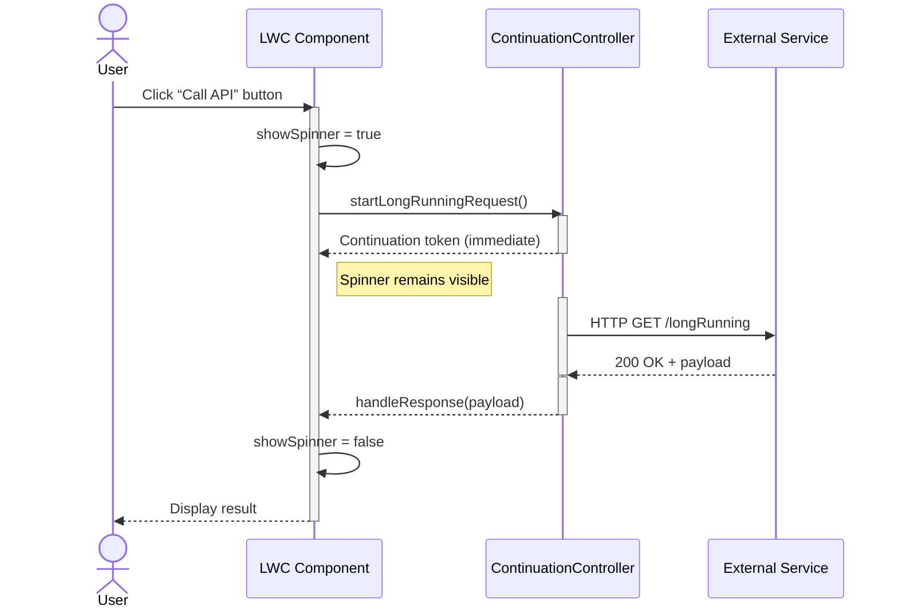

# callout

```mermaid
sequenceDiagram
    actor User
    participant LWC as LWC Component
    participant Apex as ContinuationController
    participant External as External Service

    User->>LWC: Click “Call API” button
    activate LWC
    LWC->>LWC: showSpinner = true
    LWC->>Apex: startLongRunningRequest()
    activate Apex
    Apex-->>LWC: Continuation token (immediate)
    deactivate Apex
    Note right of LWC: Spinner remains visible

    %% Asynchronous callout outside original transaction
    activate Apex
    Apex->>External: HTTP GET /longRunning
    External-->>Apex: 200 OK + payload
    deactivate Apex

    activate Apex
    Apex-->>LWC: handleResponse(payload)
    deactivate Apex

    LWC->>LWC: showSpinner = false
    LWC-->>User: Display result
    deactivate LWC

```
